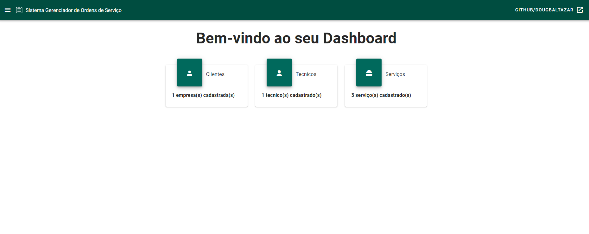
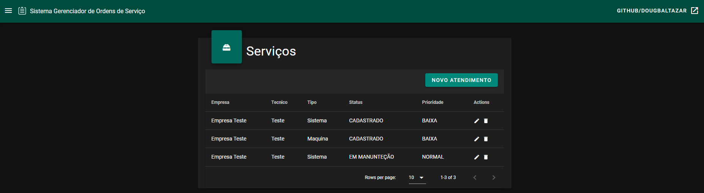

# SGOS
O SGOS foi um projeto que me foi proposto, e eu o fiz em Vue com o Back-end feito em Springboot.

### Imagem do dashboard:


## Outras imagens aqui [Outras Imagens](https://github.com/douglasbaltazar/sgos-vue/tree/master/imagens)


### Tambem com a opção de Modo Noturno


## Back-end utilizado:

### [SGOS-BackEnd](https://github.com/douglasbaltazar/SCOS-BackEnd)


## Project setup
```
npm install
```

### Compiles and hot-reloads for development
```
npm run serve
```

### Compiles and minifies for production
```
npm run build
```

### Lints and fixes files
```
npm run lint
```

### Customize configuration
See [Configuration Reference](https://cli.vuejs.org/config/).
